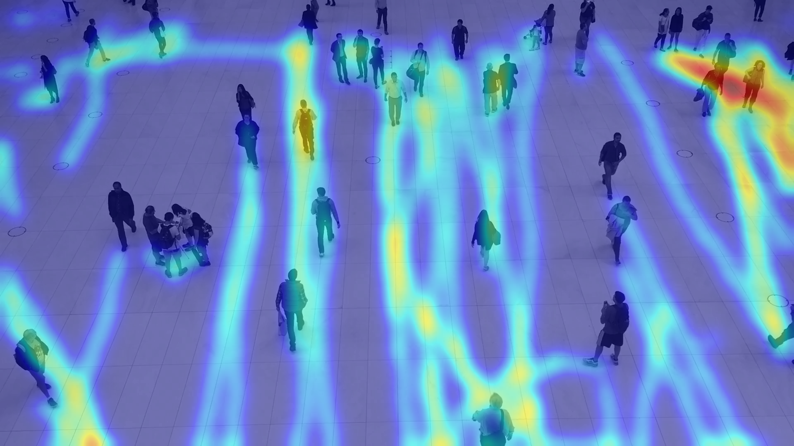

<div align="center">

# Gerador de Mapas de Calor para Otimização de Espaços Públicos

[](https://www.python.org/) [](https://docs.ultralytics.com/pt/) [](https://gradio.app/) [](https://huggingface.co/spaces) [](https://github.com/wwwmisla/gerador-mapas-calor/blob/main/LICENSE) 

[🚀 **Aplicação Interativa**](https://huggingface.co/spaces/wwwmisla/gerador-mapas-calor) **|** [📓 **Notebooks do Projeto**](https://github.com/wwwmisla/gerador-mapas-calor/blob/main/notebooks/) **|** [🎬 **Vídeo de Apresentação**](#) **|** [📂 **Código Fonte**](https://github.com/wwwmisla/gerador-mapas-calor/)

</div>

<br>

**Sistema de *Visão Computacional* que utiliza rastreamento de objetos para transformar vídeos de vigilância em *mapas de calor de fluxo*, identificando padrões de movimentação e zonas de alta densidade em espaços públicos.**

<div align="center">


<small>Exemplo de um mapa de calor de fluxo gerado pela aplicação, sobreposto a um frame do vídeo original.</small>

</div>

---

### Sumário

- [1. Introdução: O Problema e a Proposta](#1-introdução)
- [2. Metodologia e Desenvolvimento](#2-metodologia-e-desenvolvimento)
  - [2.1. Gestão e Etapas do Projeto](#21-gestão-e-etapas-do-projeto)
  - [2.2. A Etapa da Experimentação](#22-a-etapa-da-experimentação)
  - [2.3 Gerador de Mapas de Calor](#23-gerador-de-mapas-de-calor)
  - [2.4. A Técnica Final: Heatmap Adaptativo por Densidade de Fluxo](#24-a-técnica-final-heatmap-adaptativo-por-densidade-de-fluxo)
  - [2.4. Tecnologias Empregadas](#24-tecnologias-empregadas)
- [3. Resultados e Análise](#3-resultados-e-análise)
  - [3.1. Análise Qualitativa dos Artefatos Gerados](#31-análise-qualitativa-dos-artefatos-gerados)
  - [3.2. Análise Crítica, Limitações e Trabalhos Futuros](#32-análise-crítica-limitações-e-trabalhos-futuros)
- [4. Estrutura do Projeto](#4-estrutura-do-projeto)
- [5. Demonstração da Aplicação](#5-demonstração-da-aplicação)
- [6. Apresentação em Vídeo](#6-apresentação-em-vídeo)
- [7. Como Executar Localmente](#7-como-executar-localmente)
- [8. Equipe do Projeto](#8-equipe-do-projeto)
- [9. Licença](#9-licença)
- [10. Referências Bibliográficas](#10-referências-bibliográficas)

---

### 1. Introdução

Este projeto foi desenvolvido como trabalho final para a disciplina de **Visão Computacional (2025.1)**, ministrada pelo Prof. Dr. Helton Maia na **Escola de Ciências e Tecnologia (ECT/UFRN)**. O trabalho se enquadra na categoria de **Detecção de Objetos** e **Modelos de Sequência**, focando na análise de trajetórias ao longo do tempo.

A otimização de espaços públicos (praças, terminais de transporte e eventos, são exemplos) é um desafio relevante que impacta diretamente a mobilidade, a segurança e a experiência urbana. Assim, compreender como as pessoas se movem nesses ambientes é essencial para identificar gargalos, zonas subutilizadas e áreas de congestionamento, pois, os métodos tradicionais para essa análise, como observações manuais ou sensores especializados, tendem a ser caros, imprecisos e de difícil escalabilidade.

Como alternativa, propomos uma aplicação computacional baseada em técnicas de **Visão Computacional**, que automatiza a *análise do fluxo* de pessoas a partir de vídeos de vigilância. A aplicação transforma vídeos simples — capturados por câmeras fixas — em *mapas de calor de fluxo*, que destacam visualmente os caminhos mais percorridos e as regiões com maior concentração de movimento.

Essa visualização funciona como uma "autoestrada invisível", permitindo uma interpretação rápida e intuitiva dos padrões de movimentação. A solução combina algoritmos de detecção e rastreamento de objetos com lógica adaptativa de visualização, resultando em uma ferramenta prática para tomada de decisões em contextos urbanos e logísticos.

A aplicação foi construída de forma modular, evoluindo de um protótipo em **Jupyter Notebook** para uma versão interativa na web, disponibilizada por meio da plataforma **Hugging Face Spaces**.

--- 

### 2. Metodologia e Desenvolvimento

O projeto foi estruturado com um planejamento claro, evoluindo de uma prova de conceito em **Jupyter Notebook** para uma aplicação web modular e interativa, utilizando **YOLOv8 com rastreamento nativo**, lógica adaptativa de visualização e técnicas de **Visão Computacional** para transformar vídeos em **mapas de calor de fluxo** de pessoas.

#### **2.1. Gestão de Tarefas e Etapas**

Para organizar o desenvolvimento, utilizamos o sistema de **Issues do GitHub**, dividindo o projeto em etapas claras e rastreáveis. Cada etapa representa um marco no desenvolvimento, desde a configuração inicial até a implantação final, alinhado com o cronograma proposto para a disciplina.

**[📊 Acompanhe o progresso do projeto em nossa Issue de Etapas](https://github.com/wwwmisla/gerador-mapas-calor/issues/1)**

#### 2.2. A Etapa da Experimentação

A experimentação foi conduzida de forma iterativa e incremental: Os aprendizados e códigos de cada fase estão documentados no notebook [`evolucao.ipynb`](./notebooks/evolucao.ipynb), consolidando insights dos diretórios `maps_0/`, `maps_1/` e do `gerador-mapas-calor.ipynb`, que serviu como base para a aplicação final. 
Abaixo, uma síntese dos principais aprendizados:

| Fase | Técnica Utilizada | Resultado e Aprendizado |
| :--- | :--- | :--- |
| **Inicial** | **Detecção:** YOLOv8 <br> **Rastreamento:** DeepSORT <br> **Visualização:** `matplotlib.hist2d` | **Sucesso:** Provou que o conceito era viável. <br> **Falha:** O resultado visual era um histograma quadriculado, não um mapa de calor (inicialmente apenas o terminal era utilizado) e a integração com DeepSORT era complexa. |
| **Intermediária** | **Detecção:** YOLOv8 <br> **Rastreamento:** Tracker Manual (SORT-like) <br> **Visualização:** `cv2.addWeighted` | **Sucesso:** Adotamos o OpenCV para gerar um heatmap suave e sobreposto ao vídeo. <br> **Falha:** A lógica baseada em *pontos de presença* criava "bolhas" de calor estáticas, não representando o *fluxo* do movimento. Nosso tracker manual era frágil e perdia IDs facilmente. |
| **Final** | **Detecção:** YOLOv8 Tracker Nativo  (BoT-SORT) <br> **Visualização:** Lógica de Fluxo Adaptativo | **Sucesso:** Adoção do tracker nativo do YOLOv8 e da técnica de **desenhar trajetórias e aplicar um blur adaptativo**, que finalmente produziu o resultado profissional desejado. |

#### **2.3. Gerador de Mapas de Calor**

O desenvolvimento iterativo foi fundamental. As principais versões e aprendizados estão documentados no notebook do projeto [`gerador-mapas-calor.ipynb`](./notebooks/gerador-mapas-calor.ipynb):

-   **Versão 7.2 (Prova de Conceito):** A primeira abordagem validou com sucesso a geração de um mapa de calor a partir de trajetórias desenhadas. A técnica consistia em desenhar linhas de espessura fixa e aplicar um filtro Gaussiano para criar o efeito de "calor".
    -   **Sucesso:** A lógica fundamental de usar linhas e blur se mostrou promissora.
    -   **Falha/Limitação:** O uso de parâmetros fixos (espessura da linha, tamanho do blur) produzia resultados inconsistentes. Em vídeos com pessoas distantes (pequenas), o calor era exagerado; em vídeos com pessoas próximas (grandes), era insuficiente.

-   **Versão 8.1 (Lógica Adaptativa):** Para resolver a limitação anterior, a lógica foi refinada para ser **adaptativa**. Em vez de valores fixos, foram introduzidos "fatores" que calculam a espessura da linha e o raio do blur com base na **altura média das detecções**.
    -   **Sucesso:** Esta abordagem garantiu que a visualização se ajustasse automaticamente à escala da cena, produzindo resultados visualmente consistentes em diferentes vídeos.
    -   **Aprendizado:** A modularização do código em funções `process_video` e `generate_heatmap` nesta etapa facilitou enormemente a transição para a aplicação final.

-   **Versão 9.0 e 13.0 (Versão Final e Refatoração):** Consolidou-se a lógica adaptativa e foi adicionada a funcionalidade de gerar um vídeo com o rastreamento sobreposto simultaneamente ao mapa de calor, otimizando o processamento em uma única passagem. O código foi então refatorado para os módulos `tracker.py` e `heatmap_generator.py`, culminando na aplicação Gradio.

#### 2.4. A Técnica Final: Heatmap Adaptativo por Densidade de Fluxo

A metodologia final implementada na aplicação, que se mostrou a mais robusta e precisa, é um pipeline consolidado de quatro etapas principais:

1.  **Rastreamento com YOLOv8 e Coleta de Dados:**
    -   **Detector Base:** Utilizamos o modelo `YOLOv8s` (também foi utilizado o `YOLOv8n`), pré-treinado no dataset COCO, como nosso detector de objetos.
    -   **Filtro de Tracking:** A função `model.track()` da biblioteca Ultralytics é empregada para o rastreamento. Por padrão, esta função utiliza uma implementação do **BoT-SORT**, um algoritmo *tracking-by-detection*. O processo ocorre em duas fases para cada frame:
        -   **Predição:** Um **Filtro de Kalman** estima a próxima posição provável de cada trajetória já identificada.
        -   **Associação de Dados:** As novas detecções do YOLO no frame atual são associadas às trajetórias previstas. Essa associação utiliza uma combinação de proximidade espacial (**IoU** - Intersection over Union) e similaridade de aparência (**Re-ID**), o que permite que um ID seja mantido de forma robusta, mesmo após breves oclusões.
    -   **Coleta de Dados:** Ao final do processo, a trajetória completa (sequência de coordenadas) e a altura de cada indivíduo com um ID persistente são armazenadas para a próxima etapa.

2.  **Cálculo de Parâmetros Adaptativos:**
    -   Para garantir que a visualização seja consistente em vídeos com diferentes escalas (câmeras de perto vs. de longe), o sistema calcula a **altura média** de todas as detecções de pessoas válidas. Este valor serve como nossa métrica de escala para ajustar dinamicamente os parâmetros visuais.

3.  **Geração do Mapa de Fluxo:**
    1.  Um "canvas" (matriz `NumPy`) de fundo preto é criado com as mesmas dimensões do vídeo.
    2.  As **trajetórias** são desenhadas sobre este canvas como linhas. A **espessura** dessas linhas é calculada de forma adaptativa, como uma fração (`line_factor`) da altura média das detecções.
    3.  Um filtro de **Blur Gaussiano** é aplicado sobre as linhas desenhadas. O **tamanho do kernel** do filtro também é adaptativo, proporcional (`blur_factor`) à altura média. Este passo é crucial, pois transforma as linhas nítidas em um gradiente suave de "calor" que se intensifica onde as trajetórias se sobrepõem.
    4.  Para garantir cores vivas e evitar um resultado "desbotado", a intensidade do canvas é amplificada por um **fator de ganho (Gain)** antes da colorização.

4.  **Colorização e Sobreposição:**
    1.  O canvas de calor é normalizado para o intervalo de 0 a 255.
    2.  A função `cv2.applyColorMap` é usada com o `cv2.COLORMAP_JET` para atribuir um gradiente de cores (azul -> vermelho) à intensidade do fluxo.
    3.  Finalmente, a imagem colorida é sobreposta com transparência (`alpha`) ao primeiro frame do vídeo, fornecendo um contexto visual claro e informativo.

#### 2.4. Tecnologias Empregadas

| Categoria | Ferramentas / Bibliotecas | Finalidade no Projeto |
| :--- | :--- | :--- |
| **Linguagem de Programação** | Python 3.10 | Linguagem base para todo o desenvolvimento. |
| **Visão Computacional & IA** | Ultralytics YOLOv8s | Detector de objetos base e motor para o rastreamento (`model.track()`). |
| **Processamento de Dados & Imagem**| OpenCV | Manipulação de frames de vídeo, aplicação de filtros (GaussianBlur), colorização (ColorMap) e escrita do vídeo de saída. |
| | NumPy | Estrutura de dados fundamental para matrizes (imagens) e operações numéricas eficientes. |
| **Interface e Visualização**| Gradio | Criação e execução da interface web interativa da aplicação. |
| | Matplotlib | Utilizada na fase de experimentação (notebooks) para plotar e exibir resultados visuais. |
| **Implantação (Deploy)** | Hugging Face Spaces | Plataforma de nuvem para hospedar e compartilhar a aplicação Gradio publicamente. |
| **Ferramentas de Desenvolvimento**| Git & GitHub | Controle de versão do código e gestão do projeto (Issues). |
| | Jupyter Notebook / Colab | Ambiente interativo para a fase de pesquisa, prototipagem e validação da lógica. |

---

### 3. Resultados e Análise

A aplicação final gera dois artefatos principais: um **vídeo com rastreamento** para análise detalhada do movimento individual e um **mapa de calor estático** para uma visão geral e agregada do fluxo.

#### 3.1. Análise Qualitativa dos Artefatos Gerados

| Vídeo com Rastreamento (GIF) | Mapa de Calor de Fluxo Gerado |
| :---: | :---: |
|  |  |

A análise foi validada utilizando o vídeo `pessoas.mp4` (um vídeo de domínio público) para gerar dois artefatos visuais complementares:

*   **Vídeo com Rastreamento (à esquerda):** Fornece uma análise **microscópica** do comportamento.
    *   Mostra o rastreamento em ação, atribuindo um ID único a cada indivíduo.
    *   Permite a observação de interações específicas e a navegação individual pelo espaço.

*   **Mapa de Calor de Fluxo (à direita):** Fornece uma análise **macroscópica** do uso do espaço.
    *   Revela os principais eixos de movimentação através de zonas quentes (vermelho e amarelo).
    *   Identifica áreas de baixa circulação e espaços ociosos através de zonas frias (azul).

A combinação destes dois resultados permite uma análise completa e multi-escala. O vídeo ajuda a entender o "porquê" do comportamento individual, enquanto o mapa de calor revela o "o quê" e o "onde" dos padrões coletivos, oferecendo *insights* poderosos para a tomada de decisão.

#### **3.2. Análise Crítica, Limitações e Trabalhos Futuros** 

Uma análise crítica do estado atual do projeto revela tanto pontos fortes na abordagem escolhida quanto oportunidades claras para evolução.

- **Pontos Fortes:**

    O principal ponto forte do projeto é a sua **metodologia de heatmap adaptativo por densidade de fluxo**, que se mostrou robusta em vídeos com diferentes escalas e densidades de pessoas, ajustando-se dinamicamente ao cenário. A interface desenvolvida com **Gradio** cumpre o objetivo de democratizar o acesso à ferramenta, permitindo que usuários sem conhecimento técnico possam realizar análises complexas de forma intuitiva.

- **Limitações Atuais:**

    A principal limitação reside na performance do modelo **YOLOv8s pré-treinado**, que é um generalista. Em cenários desafiadores com **oclusão severa** (pessoas se sobrepondo) ou indivíduos muito distantes da câmera, a precisão do rastreamento pode diminuir. Adicionalmente, identificamos outras limitações a serem consideradas:
    -   **Dependência de Hardware:** O processamento de vídeo é computacionalmente intensivo. O desempenho em hardware sem GPU, como no deploy gratuito do Hugging Face, é lento, o que limita a análise de vídeos mais longos.
    -   **Falta de Correção de Perspectiva:** O sistema atual não implementa correção de perspectiva, o que pode levar a uma supervalorização de trajetórias mais próximas da câmera em detrimento das mais distantes.
- **Trabalhos Futuros e Evolução:**
    Com base nas limitações identificadas, traçamos um roteiro claro para a evolução e o aprimoramento da aplicação:

    1.  **Fine-Tuning do Modelo de Rastreamento:** O próximo passo ideal para um *upgrade* de precisão seria o **treinamento de um dataset customizado**. O plano inicial envolvia utilizar um dataset público de 6GB, específico para detecção de pessoas em vistas aéreas. Devido ao cronograma do projeto, demos prioridade a garantir que a aplicação estivesse robusta e funcional com o modelo pré-treinado, que já demonstrou resultados muito satisfatórios. Um modelo com *fine-tuning* neste dataset específico é o caminho natural para a evolução do projeto, criando um especialista na tarefa.

    2.  **Modos de Visualização Alternativos:** Expandir a aplicação para oferecer dois tipos de mapa de calor, respondendo a diferentes perguntas analíticas:
        -   **Mapa de Fluxo (Atual):** Baseado em trajetórias, mostra *para onde* as pessoas se movem.
        -   **Mapa de Densidade de Presença:** Baseado em pontos estáticos, mostraria *onde* as pessoas param e permanecem por mais tempo.

    3.  **Análise e Visualização em Tempo Real:** Evoluir a aplicação para um sistema dinâmico, com duas frentes de aprimoramento principais:
        -   **Visualização do Processamento:** Aprimorar a interface para que, ao enviar um vídeo, o usuário possa **assistir ao vivo** ao processo de rastreamento. Em vez de apenas uma barra de progresso, a aplicação exibiria o vídeo sendo processado, com as caixas delimitadoras e os IDs aparecendo frame a frame, fornecendo um feedback visual imediato e mais engajador.
        -   **Suporte a Fontes ao Vivo:** Como evolução final, adaptar o sistema para processar fluxos de vídeo contínuos (de uma webcam ou stream RTSP), gerando o vídeo de rastreamento e o mapa de calor dinamicamente, transformando a ferramenta em um verdadeiro **monitor de atividade em tempo real**.

    4.  **Melhorias na Interface (UI):** Aprimorar a interface do Gradio com mais opções de visualização, a possibilidade de exportar dados quantitativos (ex: contagem de pessoas por região) e uma experiência de usuário geral mais fluida.

---

### 4. Estrutura do Projeto

```bash
gerador-mapas-calor/                      # Pasta raiz do projeto
├── app/                                  # Diretório da aplicação principal (interface Gradio e lógica de execução)
│   ├── modules/                          # Módulos com código reutilizável e lógica de negócio
│   │   ├── __init__.py                   # Torna o diretório um pacote Python
│   │   ├── tracker.py                    # Script responsável por tracking de objetos (YOLO ou outro modelo)
│   │   └── heatmap_generator.py          # Script para gerar mapas de calor com base nas trajetórias
│   ├── examples/                         # Armazena vídeos de exemplo que podem ser usados como input
│   ├── temp_outputs/                     # (Ignorado pelo Git) Saídas temporárias geradas pela aplicação (ex: previews)
│   ├── weights/                          # Armazena os pesos dos modelos (ex: arquivos `.pt` do YOLO)
│   ├── README.md                         # Arquivo de descrição que o Gradio usa para mostrar explicações no app 
│   └── app.py                            # Arquivo principal que executa a interface do app com Gradio
├── data/                                 # Dados brutos para testes ou treinamento
│   ├── videos_privados/                  # Vídeos de uso restrito (dados reais e sensíveis)
│   └── videos_publicos/                  # Vídeos públicos, livres para uso e compartilhamento
├── notebooks/                            # Notebooks da fase de pesquisa e experimentação
│   ├── evolucao.ipynb                    # Notebook com histórico da evolução do código e testes
│   ├── maps_0/                           # Primeiras versões dos notebooks de geração de mapas de calor (v1)
│   ├── maps_1/                           # Segunda versão dos notebooks de mapas de calor (v2)
│   └── gerador-mapas-calor.ipynb         # Notebook consolidado com a lógica principal e base para a aplicação
├── docs/                                 # Arquivos de documentação e resultados demonstrativos
│   ├── heatmaps/                         # Exemplos de mapas de calor gerados
│   └── tracked_videos/                   # Vídeos com rastreamento visual aplicado 
├── output/                               # (Ignorado pelo Git) Resultados locais da aplicação ou notebooks
│   ├── heatmaps/                         # Mapas de calor gerados durante execuções
│   └── tracked_videos/                   # Vídeos rastreados exportados localmente
├── .gitattributes                        # Define configurações de versionamento para Git (ex: tratamento de fim de linha, linguagens, etc.)
├── .gitignore                            # Lista de arquivos e pastas a serem ignorados pelo Git (ex: temp_outputs/)
├── README.md                             # Descrição geral do projeto 
├── requirements.txt                      # Lista de bibliotecas necessárias para executar o projeto
└── LICENSE                               # Licença de uso do projeto MIT
```

---

### **5. Demonstração da Aplicação**

Uma versão funcional e interativa da aplicação está implantada e pode ser acessada publicamente através do link abaixo.

**[🚀 Teste a Aplicação Interativa no Hugging Face Spaces](https://huggingface.co/spaces/wwwmisla/gerador-mapas-calor)**

---

### **6. Apresentação em Vídeo**

Conforme solicitado nos critérios de avaliação, uma apresentação em vídeo do projeto foi produzida. O vídeo detalha o problema, as tecnologias utilizadas, os resultados obtidos e inclui uma demonstração prática da aplicação.

**[🎬 Assistir à Apresentação no YouTube](#)**

---

### 7. Como Executar Localmente

**Pré-requisitos:** Python 3.9+, Git

1.  **Clone o Repositório:**
    ```bash
    git clone https://github.com/wwwmisla/gerador-mapas-calor.git
    cd gerador-mapas-calor
    ```
2.  **Crie e Ative um Ambiente Virtual:**
    ```bash
    # Windows
    python -m venv venv
    .\venv\Scripts\activate
    # macOS / Linux
    python3 -m venv venv
    source venv/bin/activate
    ```
3.  **Instale as Dependências:**
    ```bash
    pip install -r requirements.txt
    ```
4.  **Execute a Aplicação:**
    ```bash
    python app/app.py
    ```
    Acesse a URL local fornecida no terminal (ex: `http://127.0.0.1:7860`).

---

### 8. Equipe do Projeto

Este trabalho foi desenvolvido por alunos da disciplina de Visão Computacional da Escola de Ciências e Tecnologia (ECT/UFRN), sob a orientação do Prof. Dr. Helton Maia.

<table>
  <tr>
    <td align="center">
      <a href="https://github.com/wwwmisla"><br/><sub><b>Misla Wislaine</b></sub></a><br/><sub>Desenvolvedora & Pesquisadora</sub>
    </td>
    <td align="center">
        <a href="https://github.com/SamuelRCosta-Dev"><br/><sub><b>Samuel Costa</b></sub></a><br/><sub>Desenvolvedor & Pesquisador</sub>
    </td>
    <td align="center">
        <a href="https://github.com/heltonmaia"><br/><sub><b>Helton Maia</b></sub></a><br/><sub>Professor Orientador</sub>
    </td>
  </tr>
</table>

---

### 9. Licença
Este projeto é licenciado sob a **Licença MIT**. Veja o arquivo [LICENSE](LICENSE) para mais detalhes.

---

### 10. Referências Bibliográficas

-   ABADI, Martin et al. Gradio: Hassle-Free UI for Machine Learning Models. **arXiv preprint arXiv:1906.02569**, 2019.

-   AHARON, Nir et al. BoT-SORT: Robust Associations for Multi-Pedestrian Tracking. **arXiv preprint arXiv:2206.14651**, 2022.

-   BRADSKI, Gary. The OpenCV Library. **Dr. Dobb's Journal of Software Tools**, 2000.

-   HARRIS, Charles R. et al. Array programming with NumPy. **Nature**, v. 585, n. 7825, p. 357-362, 2020.

-   JOCHER, Glenn et al. **Ultralytics YOLOv8**. GitHub, 2023. Disponível em: <https://github.com/ultralytics/ultralytics>. Acesso em: 18 jul. 2025.